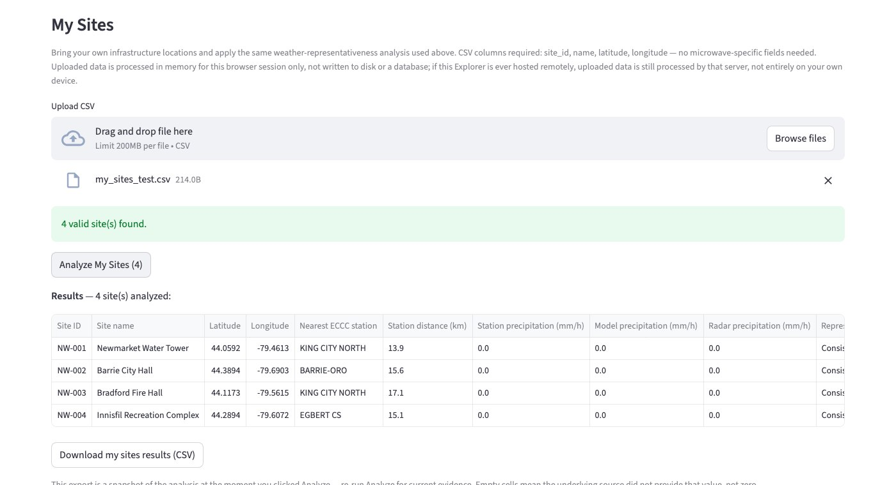
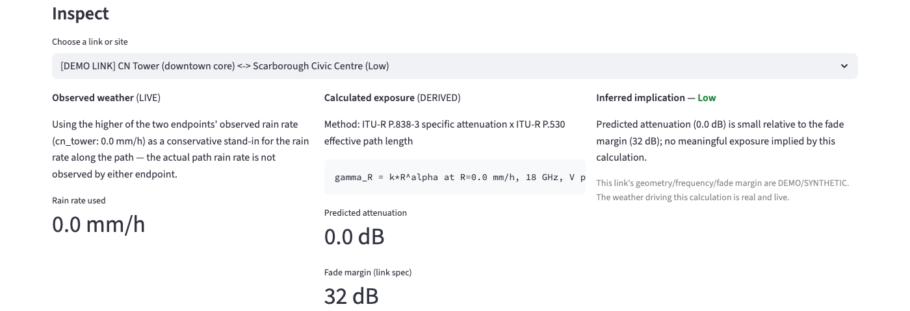
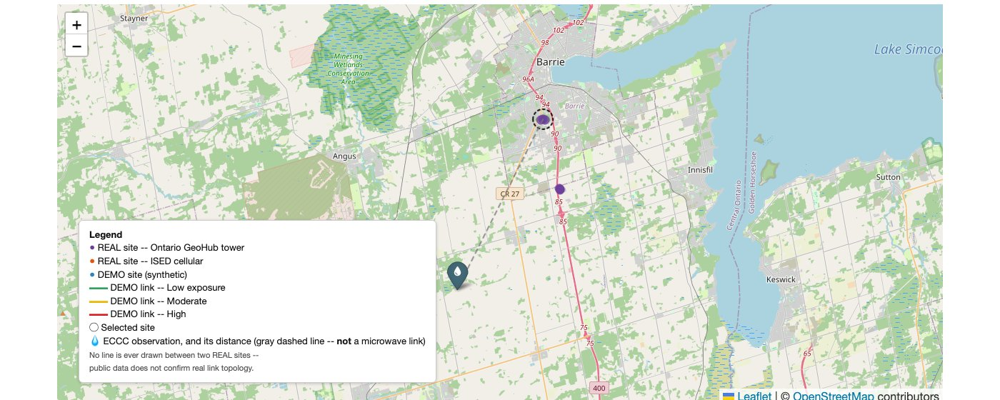
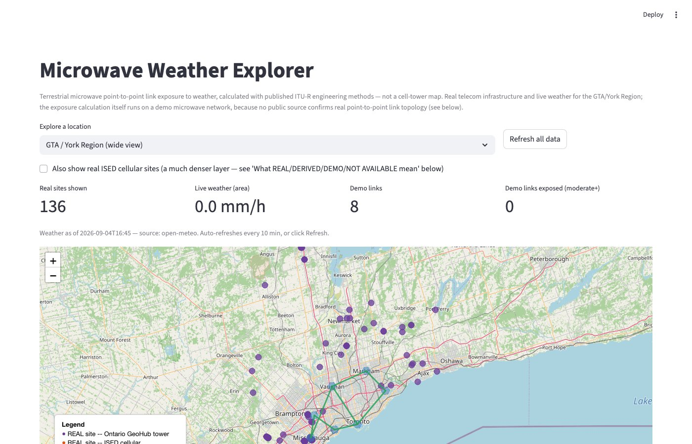

# AEI Microwave Link Exposure

[](https://pypi.org/project/aei-microwave-link-exposure/)
[](https://pypi.org/project/aei-microwave-link-exposure/)
[](https://github.com/AIDEdgeInc-Lab/aei-microwave-link-exposure/blob/main/LICENSE)
[](https://github.com/AIDEdgeInc-Lab/aei-microwave-link-exposure/actions/workflows/ci.yml)

**`aei-microwave-link-exposure`** — an AID Edge Inc. open-source engineering
library that calculates how much a terrestrial microwave point-to-point
link is exposed to weather, using published ITU-R engineering methods.
Includes **Microwave Weather Explorer**, a small map-based application
built entirely on top of the library.

Part of the AID Edge `aei-*` engineering library family, alongside
[`aei-geo-features`](https://github.com/AIDEdgeInc-Lab/aei-geo-features).

## Status & roadmap

v0.1.0 is the first installable public release of this library -- not a
pre-release, not an incomplete package. Semver's 0.x range is the standard
way to signal initial development, not a hedge about readiness. Scope
evolves through normal versioned releases, the same way
[`aei-geo-features`](https://github.com/AIDEdgeInc-Lab/aei-geo-features)
has grown, as real-world usage and engineering feedback inform future
development.

---

## Show me



Upload your own site list, get back an Evidence Ledger you can export --
the primary workflow, and it works anywhere the underlying public
weather/ECCC data has coverage. See [Upload My Sites](#upload-my-sites)
below.



Every result is traceable: what was observed, what was calculated from it
and how, and what that implies — never blended together.



Select any site and the map shows exactly where its nearest weather
evidence actually comes from, and how far away it is -- the same distance
also drives the inspector panel below. See
[How the engineering works](#how-the-engineering-works) below.



A separate, secondary area of the Explorer bundles one real public
infrastructure dataset and a small illustrative demo microwave network
(currently the GTA/York Region, Canada) as a worked example -- it does
not limit what region you can upload your own sites for.

---

## What is this?

Terrestrial microwave backhaul links (the fixed point-to-point radio hops
that connect towers — not a cellular/RAN concept) lose signal strength in
rain. This library calculates how much, from a rain rate and a link's
geometry/frequency/band, using ITU-R P.838-3 (specific rain attenuation)
and ITU-R P.530 (terrestrial path treatment) — published international
standards, implemented transparently and independently.

Built for anyone who operates or maintains microwave backhaul or
point-to-point wireless infrastructure and needs to weigh weather as a
possible cause before dispatching a technician -- WISP operators, ISP and
telecom field/NOC teams, transport and network engineers, and private
network operators alike. It is not limited to any one type of operator or
any one region.

## Why this exists

> **Is it the weather, or your hardware? Evidence before the truck roll.**

A received-signal-level (RSL) drop, a link flap, an SNMP alarm -- these
tell you *something changed*. They do not, by themselves, tell you why.

> **RSL tells you something changed. It does not, by itself, tell you
> why.**

Before a technician drives out, or before hardware gets blamed, it helps
to know: was there independent, public weather evidence of meaningful
precipitation near this site at the relevant time? This tool answers
exactly that question, transparently, and stops there.

## What this can and cannot tell you

- **It shows evidence, not a verdict.** For a site, it shows what
  independent public weather evidence exists nearby (a live observing
  station, a model reading, and radar where available) and whether that
  evidence agrees or disagrees with itself. It does not decide anything
  for you.
- **Not a hardware diagnosis.** It never determines hardware condition,
  never assigns a risk score, failure probability, or confidence
  percentage, and never tells you a specific unit failed or will fail.
- **Not an outage predictor.** No historical outage or performance data;
  no such claim is made anywhere in the library or the Explorer.
- **Not a cellular coverage map, macro-cell planning tool, or RAN
  analytics product.** It has nothing to say about mobile signal coverage
  or cellular network performance.
- **Not a confirmed microwave topology database.** Public communications
  infrastructure records (towers, cellular sites) are not equivalent to
  confirmed microwave links, and this project does not treat them as one.
  It never infers a link from tower proximity, antenna azimuth,
  frequency, height, or geographic alignment -- no matter how convincing
  the geometry looks. See [Provenance](#provenance) below.
- **Not an AI/ML product.** No forecasting model, no learned weights, no
  proprietary scoring -- every number traces back to a stated formula or
  a cited source.

## Upload example

The fastest way to see the workflow is with the working example file at
[`examples/my_sites_example.csv`](examples/my_sites_example.csv) -- the
Explorer also offers it directly as a "Download example CSV" button next
to the upload control.

**Minimal CSV schema** -- only four columns are required, and no
microwave-specific fields (frequency, fade margin, endpoint pairing, ...)
are needed or accepted, because this is about site-location weather
evidence, not link design:

```csv
site_id,name,latitude,longitude
NW-001,North Site,44.3500,-79.7000
NW-002,Barrie West,44.3800,-79.7600
```

## Upload My Sites

**Workflow:** Upload CSV → Analyze → Inspect → Export.

1. Upload a CSV of your own infrastructure sites (or the example above).
2. The Explorer validates it immediately and tells you plainly how many
   rows are usable and how many need attention -- invalid rows (bad
   coordinates, duplicate or empty `site_id`) are skipped individually
   and named, never silently dropped; a missing required column or an
   empty file rejects the whole upload with a clear message.
3. Click **Analyze Sites**. For each site, the Explorer looks up the
   nearest live ECCC observing station, a model reading at the site's own
   coordinates, and radar where available, then compares them.
4. A compact summary (sites analyzed, how many found a nearby station,
   the breakdown of results) appears immediately, computed from that
   run's actual results -- nothing here is invented or hardcoded.
5. Inspect any site on the map or in the panel below it. Export the
   result. See [Evidence Ledger](#evidence-ledger) and
   [Export](#export) below.

**"Insufficient evidence" is an expected, honest result**, not an error
-- it means there wasn't enough independent weather evidence nearby to
make a comparison for that site, and it is never silently substituted
with a low-risk or zero value.

**Privacy:** uploaded data is processed in memory for your browser
session only -- never written to disk or a database by this application.
If this Explorer is ever hosted remotely, uploaded data is still
processed by that server (coordinates are sent to Open-Meteo/ECCC to look
up nearby evidence); it is not an entirely local/client-side computation.

## Evidence Ledger

Every analyzed site becomes one row: the site, its representativeness
result, the nearest ECCC station and its distance, the precipitation
evidence from each source, and a plain-language explanation --
prioritized for scanning, with coordinates and identifiers kept but not
dominant.

**Provenance:** an uploaded site is `Provenance.USER_PROVIDED` -- **not**
`REAL` (that label is reserved for cited public sources like Ontario
GeoHub/ISED) and **not** `DEMO` (a user's own infrastructure is
presumably real, just unverified here). Weather evidence for a
user-provided site is sourced exactly as transparently as for a public
site: the nearest ECCC station remains OBSERVED, the distance remains
CALCULATED, and the representativeness label remains INTERPRETED --
nothing about the analysis changes because the site came from a CSV
instead of a government dataset.

A cell an underlying source didn't provide is left empty, never
substituted with a zero or a guess -- see
[Weather representativeness](#weather-representativeness) below for what
each interpreted label means.

## Export

**Download Evidence CSV** produces a snapshot of the current analysis --
stable, human-readable column names, no internal Python objects -- for
engineering review or internal sharing. It reflects the moment you
clicked Analyze, not live or ongoing monitoring, and it is not a claim
that hardware failed or that an outage was prevented -- it is the
evidence, exported.

## How the engineering works

```
ITU-R P.838-3  +  ITU-R P.530  +  Haversine geometry
                        ↓
              aei_mw_exposure (core)
              zero runtime dependencies
                        ↓
        optional adapters (need `requests`)
   Open-Meteo  ·  Ontario GeoHub  ·  ISED  ·  ECCC
                        ↓
         Microwave Weather Explorer
           (Streamlit + Folium)
```

The core is reusable on its own — no Streamlit, no Folium, no network
call required. Adapters are optional and swappable. The Explorer is a
consumer of the core; it contains no calculation logic of its own.

### The calculation, step by step

```
link geometry (two sites)  →  haversine distance
                                       +
weather source            →  rain rate at each endpoint
                                       ↓
                    higher of the two endpoints' rain rate
                          (a stated, conservative assumption)
                                       ↓
              ITU-R P.838-3: specific attenuation (dB/km)
                                       ×
              ITU-R P.530: effective path length (km)
                                       ↓
                    predicted attenuation (dB)
                                       ÷
                       link's stated fade margin
                                       ↓
                 exposure ratio  →  severity (low/moderate/high)
```

Runnable version of exactly this: `examples/basic_usage.py`. This full
exposure calculation currently runs on the bundled demo microwave network
(see below) because confirmed link geometry is required and is not
available from public sources for real infrastructure -- your own
uploaded sites get the weather-representativeness evidence above, not
this calculation, for the same reason.

### Data sources

| Source | Type | Used for | Provenance |
|---|---|---|---|
| Ontario GeoHub — Tower dataset (MNRF) | Public government data | Real telecom tower locations + classification | `REAL` |
| ISED Spectrum Licences Site Data | Public government data | Real cellular/mobile site records (not microwave-band) | `REAL` |
| Open-Meteo | Public weather data (model) | Live rain rate, temperature, wind at any coordinate | `REAL` |
| ECCC SWOB-Realtime | Public government data (station observation) | Nearest live observing-station reading for representativeness | `REAL` |
| ECCC Radar (`RADAR_1KM_RRAI`) | Public government data (radar estimate) | Radar-estimated rain rate at a site's own coordinates | `REAL` |

Full detail, licensing, and each source's real limitations are documented
directly in `src/aei_mw_exposure/infrastructure/ontario_geohub.py`,
`ised.py`, and `src/aei_mw_exposure/providers/eccc.py` -- each module
states exactly what its source confirms and does not confirm.

Ontario GeoHub and ISED coverage is specific to Canada; Open-Meteo and
ECCC's live station/radar coverage extend more broadly. Your own uploaded
sites are analyzed wherever the underlying weather/ECCC data has
coverage -- this project does not hard-code a region into that workflow.

### Provenance

| Label | Meaning |
|---|---|
| `REAL` | Directly from a cited public record. Only fields the source actually published are shown. |
| `DERIVED` | Calculated by this library from REAL or DEMO inputs, using a stated method (e.g. haversine distance, the exposure calculation itself). |
| `DEMO` | Synthetic demonstration data. Realistic-looking, never presented as real. |
| `NOT_AVAILABLE` | Genuinely not available from any public source checked — a marker, not a guess. |
| `USER_PROVIDED` | Asserted by the person using this tool (e.g. an uploaded site list). Presumably real, but not independently verified — never labeled `REAL` or `DEMO`. |

**Confirmed real-world point-to-point microwave topology is
`NOT_AVAILABLE`** from the public sources this project uses. No line is
ever drawn between two real or user-provided sites, and no link is ever
inferred from proximity, azimuth, frequency, or geographic alignment.
This is the central, deliberate limitation of the project — not an
oversight.

### Observed → Calculated → Inferred

Independent of provenance, every result -- exposure or weather
representativeness -- keeps these three epistemic categories distinct:

```
OBSERVED                          CALCULATED                       INFERRED
weather provider rain rate   →    haversine distance          →    severity (low/moderate/high)
published infrastructure          ITU-R specific attenuation       or representativeness label
  metadata                        ITU-R effective path length      ("consistent", "moderate
timestamp, source                 predicted attenuation (dB)        disagreement", ...) --
                                   exposure ratio                    never a hardware verdict
```

### Weather representativeness

Select a site to see the nearest ECCC precipitation observation and the
physical distance between them, directly on the map -- a dashed ring on
the selected site, a pin marker on the station, and a thin gray dashed
line between them showing the distance. That line is **not** styled like
a microwave link (which is always a solid, coloured line) on purpose --
it means exactly one thing: physical separation between the
infrastructure and the weather-observation source, nothing more. The same
evidence is also shown as text in the inspector panel below the map.

**What problem does this solve?** A weather value reported for a city --
or a coarse weather-model grid cell -- may not match conditions at a
specific infrastructure site several kilometres away, especially during
spatially variable precipitation. Before trusting a weather value at a
site, it helps to know how much independent evidence actually supports it
there.

**Why can a city weather value differ from conditions at a site?**
Precipitation is not spatially uniform, particularly for convective rain.
A model's grid cell and the nearest observing station both describe
conditions *near* a point, not necessarily *at* it -- distance and source
agreement are the two facts that tell you how much that matters here.

**What data sources are used?** A live ECCC observing station (nearest
within a search radius, via SWOB-Realtime), a model value at the site's
own coordinates (Open-Meteo, the same provider used elsewhere in this
project), and, when available, an ECCC radar-estimated rate at the site's
own coordinates (`RADAR_1KM_RRAI`, updated every 6 minutes).

**What is observed?** The station's own reading and the model's own
reading, each unmodified, each with its own timestamp and source.

**What is calculated?** The distance from the site to the nearest
station (haversine, reusing the same function used for link geometry
elsewhere in this library), and the numeric difference between the
station and model precipitation values, when both are available.

**What is interpreted?** A plain-language label --
Consistent / Moderate disagreement / High disagreement / Insufficient
evidence -- driven by two small, named, stated thresholds (default 50 km,
default 2 mm/h; both overridable). This is a documented convention, the
same kind already used for exposure severity elsewhere in this library --
**not** a statistical confidence score, and never a hardware diagnosis.

**What does this explicitly NOT claim?**
- Not hyperlocal weather or microclimate prediction -- nothing here
  predicts anything; it compares evidence that already exists right now.
- Not AI weather, not a forecast, not a numeric confidence percentage.
- Not a claim that a station or model value is "wrong" -- disagreement
  between two correct, independent readings is the finding itself.
- A station that doesn't publish precipitation is shown as exactly that
  (not silently treated as zero rain).
- Radar is shown as a third piece of evidence but does not currently
  factor into the interpreted label -- a stated scope limit, not an
  oversight (see `representativeness.py`).

### Explore public infrastructure (secondary, example region)

A separate area of the Explorer bundles real Ontario public telecom
infrastructure records and a small illustrative demo microwave network --
the only network with a full engineering exposure calculation, since it
is the only one with confirmed link geometry. It is currently available
for the GTA/York Region (Canada) as a worked example of what the
underlying engineering can do when link topology is known; it does not
limit which region your own uploaded sites can be analyzed for.

## Limitations

- **Confirmed real-world point-to-point microwave link topology is not
  available** from the public sources this project uses (see
  [Provenance](#provenance)). This is the project's central, deliberate
  honesty constraint, not an implementation gap.
- The rain rate used for a demo link is the higher of its two endpoints'
  observed rate — a conservative stand-in for path rain, not a
  measurement of it.
- The P.530 effective-path-length factor is a long-term statistical
  design approximation, reused here for an instantaneous rain rate.
- Severity and representativeness levels are a simple, overridable,
  documented convention, not a validated risk model or a confidence
  score.
- Real infrastructure coverage (Ontario GeoHub, ISED) is genuinely uneven
  by area and specific to Canada — a location with zero results there has
  a dataset gap, not zero infrastructure; your own uploaded sites are not
  limited by this.
- The ISED cellular layer's host has flagged that mirror deprecated and
  updates it twice a year; the Explorer degrades gracefully if it's down.

## Requirements

| Component | Requirement |
|---|---|
| Python | >= 3.9 |
| Core library | none (stdlib only) |
| Weather / infrastructure adapters | `requests` |
| Explorer | `streamlit`, `folium`, `streamlit-folium`, `requests` |
| Tests | `pytest` |

## Install

```bash
pip install -e .                              # core library only, zero dependencies
pip install -e ".[open-meteo]"                # + the free/keyless Open-Meteo weather provider
pip install -e ".[infrastructure]"            # + the Ontario GeoHub / ISED real-data adapters
pip install -e ".[explorer]"                  # + the Streamlit map Explorer
pip install -e ".[dev]"                       # + pytest
```

## Quick start

```python
from aei_mw_exposure import MicrowaveSite, MicrowaveLink, Provenance, WeatherObservation, calculate_exposure

site_a = MicrowaveSite(id="a", name="Toronto North", latitude=43.8, longitude=-79.4, provenance=Provenance.DEMO)
site_b = MicrowaveSite(id="b", name="Toronto East", latitude=43.7, longitude=-79.2, provenance=Provenance.DEMO)

link = MicrowaveLink(
    id="L1", site_a=site_a, site_b=site_b, frequency_ghz=18.0,
    polarization="V", fade_margin_db=32.0, provenance=Provenance.DEMO,
    # length_km is not passed in -- it's derived from the two sites' real coordinates
)

result = calculate_exposure(
    link=link,
    weather_by_site={
        site_a.id: WeatherObservation(latitude=43.8, longitude=-79.4, timestamp="2026-09-04T14:00", rain_rate_mm_h=22.0, source="test-fixture"),
        site_b.id: WeatherObservation(latitude=43.7, longitude=-79.2, timestamp="2026-09-04T14:00", rain_rate_mm_h=6.0, source="test-fixture"),
    },
)

print(result.severity)                                # "moderate" | "low" | "high"
print(result.exposure_ratio)                           # attenuation / fade margin
print(result.attenuation.predicted_attenuation_db)      # the physics estimate
print(result.attenuation.k, result.attenuation.alpha)   # ITU-R P.838-3 coefficients used
print(result.rain_rate_assumption)                       # states the worse-endpoint assumption explicitly
```

No Streamlit, no browser, no network call required. Fuller runnable
version: `examples/basic_usage.py`.

### Loading real infrastructure

```python
from aei_mw_exposure.infrastructure import ontario_geohub

sites, skipped, exceeded_limit = ontario_geohub.load_towers_in_bbox(
    bbox=(-79.56, 43.96, -79.36, 44.16)  # (min_lon, min_lat, max_lon, max_lat) -- Newmarket area
)
for site in sites:
    print(site.provenance, site.source, site.name, site.metadata)
```

Every site produced this way is `Provenance.REAL`. Nothing in
`aei_mw_exposure.infrastructure` ever produces a `MicrowaveLink`.

### Run the Explorer

```bash
pip install -e ".[explorer,open-meteo,infrastructure]"
streamlit run app.py
```

## Explorer workflow

1. Upload your own sites (or the example CSV) and click Analyze -- see
   [Upload My Sites](#upload-my-sites).
2. Review the Evidence Ledger summary and per-site results.
3. Inspect any site: its identity, its weather evidence, and what that
   evidence does and doesn't mean.
4. Export the Evidence CSV.
5. Separately, explore the bundled public-infrastructure example region
   and its demo microwave network, including the one network with a full
   engineering exposure calculation -- see
   [Explore public infrastructure](#explore-public-infrastructure-secondary-example-region).

No step here is aspirational — this is exactly what the app in this
repository does today.

## Project structure

```
aei-microwave-link-exposure/
├── src/aei_mw_exposure/
│   ├── geometry.py           haversine distance
│   ├── microwave.py           MicrowaveSite / MicrowaveLink domain model
│   ├── weather.py               WeatherObservation + WeatherProvider interface
│   ├── physics.py                 ITU-R P.838-3 / P.530
│   ├── exposure.py                 calculate_exposure() -- the one entry point
│   ├── provenance.py                 REAL / DERIVED / DEMO / NOT_AVAILABLE / USER_PROVIDED
│   ├── representativeness.py           assess_representativeness() -- station/model/radar comparison
│   ├── providers/                        optional weather adapters (open_meteo.py, eccc.py)
│   └── infrastructure/                     optional real-data adapters (ontario_geohub.py, ised.py)
├── demo/
│   ├── network.py             the synthetic demo microwave network
│   ├── locations.py            the Explorer's location picker
│   └── user_sites.py            CSV parsing for "Upload My Sites" (stdlib only)
├── docs/images/                screenshots used in this README
├── tests/                      110+ deterministic tests, no live network calls
├── examples/
│   ├── basic_usage.py          runnable library example
│   └── my_sites_example.csv     a working "Upload My Sites" CSV
├── app.py                      the Explorer -- a consumer of the library only
├── CONTRIBUTING.md
├── LICENSE
└── pyproject.toml
```

## Contributing

| Contribution | Goes in |
|---|---|
| New weather provider | `src/aei_mw_exposure/providers/` |
| New infrastructure source | `src/aei_mw_exposure/infrastructure/` |
| Engineering calculation / physics | `src/aei_mw_exposure/` |
| "Upload My Sites" CSV parsing | `demo/user_sites.py` |
| Explorer UI | `app.py` |
| Tests | `tests/` |

Full ground rules (dependency boundaries, what a new infrastructure
source must and must not claim, style) are in
[CONTRIBUTING.md](CONTRIBUTING.md).

## Future work (not implemented)

Documented, not built:
nationwide infrastructure coverage, a real ISED Fixed Service (true
microwave-band) integration if a live query interface becomes available,
OpenStreetMap as a supplementary source, and a licensee-shared real link
dataset if one is ever made available. None of these are implied to exist
today.

## License

MIT — see [LICENSE](LICENSE). Real infrastructure data retains its own
government licensing (Open Government Licence – Ontario / Canada); see
[Data sources](#data-sources) above for attribution.
